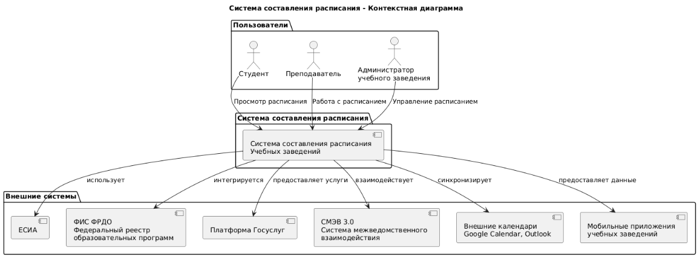
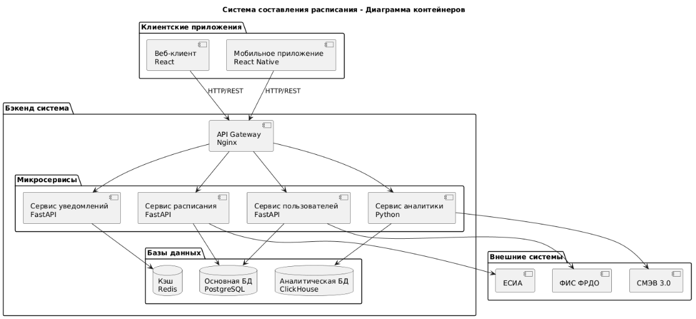
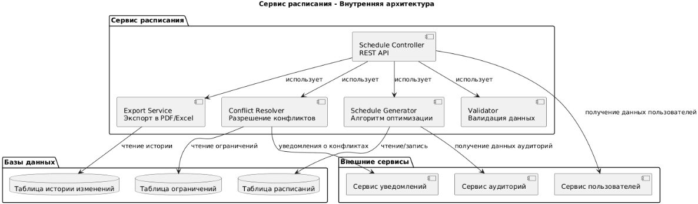
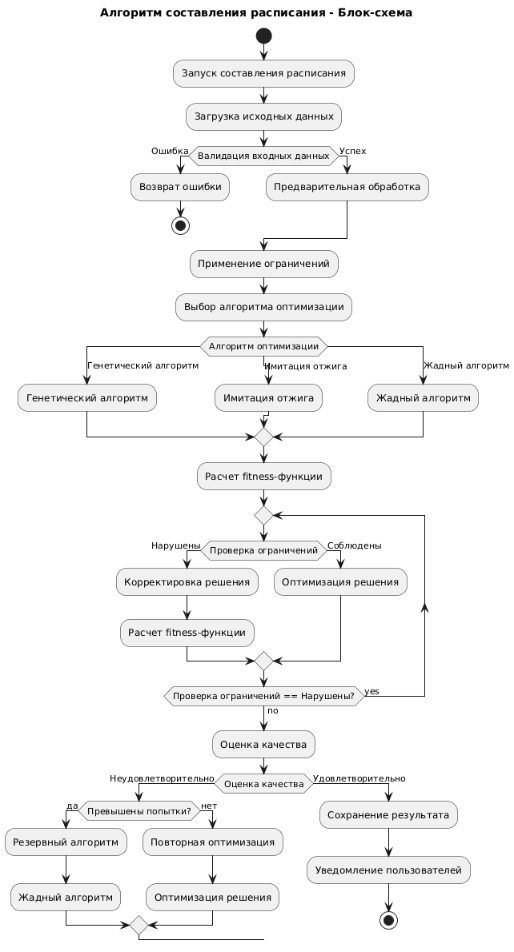

# 1. Введение
Настоящая концепция разработана для цифровой трансформации процессов составления и управления учебными расписаниями в образовательных учреждениях Российской Федерации с использованием единой цифровой платформы «ГосТех».

Предметная область — автоматизированное составление расписаний — охватывает взаимодействие между администрацией учебных заведений, преподавателями, студентами и органами управления образованием. Концепция направлена на повышение эффективности, прозрачности и качества образовательного процесса через клиентоцентричную архитектуру и стандартизированные цифровые сервисы.

# 2. Описание проблемы, цели, ограничений и приоритетных клиентских путей

## 2.1. Проблемы текущего состояния
Ручное составление расписания: сложный и трудоёмкий процесс, требующий учёта множества факторов и ограничений

Частые ошибки и конфликты: пересечение аудиторий, преподавателей, учебных групп

Отсутствие единой системы: использование разрозненных инструментов и методов в разных учебных заведениях

Сложность оперативных изменений: трудности при внесении корректировок в течение учебного периода

Недостаточная интеграция с другими образовательными системами и сервисами

## 2.2. Цели концепции
Автоматизировать процесс составления расписания с учётом всех требований и ограничений

Сократить время составления расписания на 80% по сравнению с ручными методами

Обеспечить прозрачность и обоснованность распределения учебной нагрузки

Создать единое цифровое пространство для управления учебным процессом

Обеспечить оперативное внесение изменений и уведомление всех участников

## 2.3. Ограничения
Необходимость соблюдения требований Федеральных государственных образовательных стандартов (ФГОС)

Учёт специфики разных уровней образования (школы, колледжи, вузы)

Требования к защите персональных данных учащихся и преподавателей

Разный уровень цифровой зрелости образовательных учреждений

## 2.4. Приоритетные клиентские пути

### Пользователь: Администратор учебного заведения
Ключевая роль в процессе формирования, корректировки и утверждения учебного расписания.

| Этап                           | Что делает                                                                               | Опыт                                                                                                                                      | Эмоции                                                                                    |
|--------------------------------|------------------------------------------------------------------------------------------|-------------------------------------------------------------------------------------------------------------------------------------------|-------------------------------------------------------------------------------------------|
| 1. Сбор данных и требований    | Собирает исходные данные: учебные планы, доступность аудиторий, пожелания преподавателей | Получает данные из разных источников (электронные таблицы, письма, устные договоренности). Данные часто противоречивы и неструктурированы | Стресс, беспокойство: Понимает, что собрать полные и точные данные практически невозможно |
| 2. Формирование расписания     | Вводит данные в систему, запускает алгоритм автоматического составления                  | Система выдает несколько вариантов расписания, но некоторые конфликты остаются. Требуется ручная корректировка                            | Надежда сменяется разочарованием: Алгоритм помогает, но идеального решения нет            |
| 3. Согласование и утверждение  | Рассылает проект расписания преподавателям, собирает замечания, вносит корректировки     | Получает множество противоречивых замечаний от преподавателей. Постоянные правки "в последнюю минуту"                                     | Фрустрация, выгорание: Процесс согласования затягивается, приходится работать сверхурочно |
| 4. Публикация и информирование | Публикует итоговое расписание, уведомляет всех участников                                | Система автоматически рассылает уведомления, но часть преподавателей утверждает, что не получала их                                       | Облегчение, но с тревогой: Основной этап пройден, но остаются риски недовольства          |
| 5. Оперативные изменения       | Вносит корректировки в течение семестра (болезни, командировки)                          | Быстро находит замену в системе, но не уверен, что все участники уведомлены об изменениях                                                 | Напряжение: Каждое изменение - новый стресс и риск ошибки                                 |

### Пользователь: Преподаватель
Активный участник процесса, чьи профессиональные интересы напрямую зависят от качества расписания.

| Этап                                  | Что делает                                                                | Опыт                                                                                               | Эмоции                                                                                |
|---------------------------------------|---------------------------------------------------------------------------|----------------------------------------------------------------------------------------------------|---------------------------------------------------------------------------------------|
| 1. Предоставление данных              | Заполняет форму с предпочтениями и ограничениями                          | Отправляет свои пожелания по расписанию, но не уверен, что их учтут                                | Скептицизм: Опыт подсказывает, что мнение преподавателя редко учитывается             |
| 2. Ознакомление с проектом            | Проверяет предложенное расписание на конфликты и соответствие требованиям | Обнаруживает "окна" между занятиями, неудобное время или пересечение с личными планами             | Возмущение, обида: Чувствует, что его интересы проигнорированы                        |
| 3. Запрос изменений                   | Направляет замечания администратору                                       | Отправляет обоснованные претензии, но получает стандартные ответы "исправим в следующем семестре"  | Беспомощность: Понимает, что существенные изменения маловероятны                      |
| 4. Работа по утвержденному расписанию | Следит за актуальной версией, получает уведомления об изменениях          | Иногда узнает об изменениях от студентов, а не из официальных уведомлений                          | Недоверие к системе: Постоянно перепроверяет актуальность расписания                  |
| 5. Планирование нагрузки              | Анализирует распределение занятий в течение семестра                      | Не может эффективно планировать научную работу из-за неоптимального распределения учебной нагрузки | Профессиональная неудовлетворенность: Не может работать с максимальной эффективностью |

### Пользователь: Студент/Ученик
Конечный потребитель услуги, чья успеваемость напрямую зависит от качества расписания.

| Этап                                   | Что делает                                                   | Опыт                                                                                             | Эмоции                                                                  |
|----------------------------------------|--------------------------------------------------------------|--------------------------------------------------------------------------------------------------|-------------------------------------------------------------------------|
| 1. Ознакомление с расписанием          | Ищет актуальное расписание на семестр                        | Пытается найти последнюю версию в разных источниках: сайте, приложении, соцсетях группы          | Растерянность: Не понимает, какая версия расписания является актуальной |
| 2. Ежедневное использование            | Следит за расписанием на день/неделю                         | Обнаруживает, что расписание изменилось без предупреждения, а он пришел на пару, которой нет     | Раздражение: Тратит время впустую из-за несвоевременного информирования |
| 3. Планирование учебного процесса      | Пытается эффективно распределить время на учебу и подготовку | Сталкивается с "окнами" по 1-2 пары между занятиями, которые невозможно продуктивно использовать | Фрустрация: Не может оптимально организовать свое учебное время         |
| 4. Получение уведомлений об изменениях | Настраивает оповещения в мобильном приложении                | Иногда получает уведомления, иногда нет. Не понимает логики работы системы уведомлений           | Ненадежность: Не может полностью доверять системе                       |

## Боли пользователей

### Критические боли Администратора:

* Низкое качество исходных данных: Преподаватели предоставляют неточную информацию о доступности, которая постоянно меняется

* Ручная работа с конфликтами: 40% времени уходит на ручное разрешение пересечений, которые не смог устранить алгоритм

* Бесконечный процесс согласования: Каждое изменение в расписании запускает новый цикл согласований и претензий

* Ответственность за ошибки: Любая неточность в расписании приводит к конфликтам с преподавателями и студентами

* Отсутствие единого источника истины: Приходится работать с разрозненными данными из Excel, почты и устных поручений

### Ключевые боли Преподавателя:

* Игнорирование профессиональных потребностей: Не учитывается необходимость непрерывных блоков для исследовательской работы

* Неоптимальное распределение нагрузки: "Окна" между парами, слишком ранние или поздние занятия снижают эффективность работы

* Нестабильность расписания: Постоянные изменения мешают планировать личную жизнь и научную деятельность

* Отсутствие прозрачности процесса: Непонятно, на каких основаниях формируется итоговое расписание

* Сложность внесения корректировок: Процедура изменения расписания бюрократизирована и занимает много времени

### Основные боли Студента:

* Ненадежность информации: Не может доверять ни одному источнику расписания

* Несвоевременное информирование: Узнает об изменениях постфактум, что срывает учебный процесс

* Неэргономичное расписание: "Окна", слишком плотное расписание, ранние пары снижают эффективность обучения

* Отсутствие персонализации: Невозможно настроить уведомления под свои потребности

* Сложность планирования: Не может эффективно распределить время на учебу, работу и отдых

### Системные боли (общие для всех):

* Дублирование информации: Одни и те же данные вводятся в нескольких системах (расписание, электронный журнал, система учета)

* Отсутствие контроля корректности данных: Система не проверяет противоречия в исходных данных

* Временные задержки: Формирование итогового расписания занимает несколько недель вместо нескольких дней

* Низкая оперативность внесения изменений: Процесс корректировки растянут во времени

* Несовместимость с личными календарями: Невозможно автоматически синхронизировать расписание с Google Calendar/Outlook

# 3. Общее описание архитектуры
Архитектура реализуется в рамках домена «Образовательная деятельность» и строится по принципам доменной модели «ГосТех»:

Функциональная архитектура: клиентоцентричные процессы, сгруппированные по жизненным ситуациям («составить расписание», «внести изменения», «получить расписание»)

ИТ-архитектура: микросервисная структура на базе платформы «ГосТех» с использованием общих и доменных сервисов

Данные: единая модель данных, включающая сущности «Учебное заведение», «Преподаватель», «Студент», «Учебный план», «Аудитория», «Дисциплина»

Инфраструктура: размещение на Государственной единой облачной платформе с обеспечением отказоустойчивости и масштабируемости

# 4. Связность и интеграция
Концепция предусматривает сквозную интеграцию с внешними системами:

ЕСИА — для идентификации пользователей

ФИС ФРДО — для верификации данных об образовательных программах

Электронные дневники и журналы — для синхронизации данных

Платформа госуслуг — для предоставления сервисов гражданам

СМЭВ 3.0 — для межведомственного обмена данными

Системы управления образовательными организациями — для импорта исходных данных

Все интеграции реализуются через стандартизированные API и соответствуют требованиям «ГосТех» к интеграционной архитектуре.

# 5. Принципы проектирования
Проектирование архитектуры осуществляется на основе следующих принципов «ГосТех»:

Клиентоцентричность: проектирование от потребностей администраторов, преподавателей и учащихся

Повторное использование: применение общих сервисов «ГосТех» («Цифровой профиль», «Уведомления», «Электронная подпись»)

Интеллектуальные алгоритмы: использование методов искусственного интеллекта для оптимизации расписания

Масштабируемость: поддержка различных типов и размеров учебных заведений

Технологическая независимость: использование отечественного ПО и решений из реестра Минцифры

# Диаграмма Захмана 

| Перспектива                     | Что (Данные)                                           | Как (Функция)                                | Где (Расположение)                       | Кто (Люди)                             | Когда (Время)                                   | Почему (Мотивация)                                |
|---------------------------------|--------------------------------------------------------|----------------------------------------------|------------------------------------------|----------------------------------------|-------------------------------------------------|---------------------------------------------------|
| Контекст (Обзор)                | Учебные планы, аудитории, преподаватели, студенты      | Составление оптимального расписания занятий  | Учебные заведения РФ                     | Студенты, преподаватели, администрация | Учебный год, семестры, недели                   | Повышение эффективности образовательного процесса |
| Бизнес-концепция (Владелец)     | Кафедры, факультеты, учебные группы, дисциплины        | Распределение нагрузки, избегание конфликтов | Аудиторный фонд, корпуса                 | Деканаты, учебные части                | Расписание на семестр, график учебного процесса | Оптимизация использования ресурсов                |
| Системная логика (Архитектор)   | Сущности: Преподаватель, Аудитория, Дисциплина, Группа | Алгоритмы оптимизации, проверка конфликтов   | Логическая схема данных, API             | Роли: Админ, Преподаватель, Студент    | Жизненный цикл расписания, версионность         | Технические требования и ограничения              |
| Технология (Проектировщик)      | Таблицы БД: teachers, classrooms, schedules            | Микросервисы, REST API, алгоритмы            | Облачная платформа, серверы БД           | Системные роли, права доступа          | Реальное время, cron-задачи                     | Архитектурные принципы                            |
| Детали реализации (Разработчик) | JSON-схемы, SQL-запросы, индексы                       | Код функций, методы классов, API endpoints   | Конфигурация серверов, сетевые настройки | Учетные записи, сессии                 | Таймстампы, расписание задач                    | Технические спецификации                          |
| Функционирование (Пользователь) | Актуальное расписание, уведомления                     | Просмотр, редактирование, экспорт расписания | Web-интерфейс, мобильное приложение      | Конкретные пользователи с правами      | Ежедневное использование, изменения             | Решение практических задач                        |

# Контекстная диаграмма

# Диаграмма контейнеров

# Диаграмма компонентов

# Алгоритм

# 6. Информационная безопасность
Безопасность обеспечивается на всех уровнях:

Персональные данные учащихся и преподавателей обрабатываются в соответствии с ФЗ-152

Образовательная информация классифицируется как конфиденциальная

Сервисы разрабатываются по методологии безопасного программного обеспечения

Инфраструктура соответствует требованиям ФСТЭК и ФСБ РФ

Аутентификация — через ЕСИА с различными уровнями доступа

# 7. Экономическая эффективность
Реализация концепции обеспечивает следующие экономические эффекты:

Снижение административной нагрузки на сотрудников учебных заведений на 60-70%

Сокращение времени составления расписания с нескольких дней до нескольких часов

Уменьшение количества ошибок и конфликтов в расписании

Повышение эффективности использования аудиторного фонда и преподавательских ресурсов

Улучшение качества образовательного процесса за счёт оптимального планирования

Снижение затрат на программное обеспечение за счёт использования единой платформы «ГосТех»

Финансирование осуществляется в рамках национального проекта «Образование» и бюджетов профильных ведомств (Минпросвещения, Минобрнауки, Минцифры).
