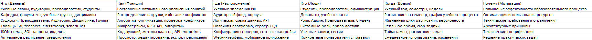

# 1. Введение
Настоящая концепция разработана для цифровой трансформации процессов составления и управления учебными расписаниями в образовательных учреждениях Российской Федерации с использованием единой цифровой платформы «ГосТех».

Предметная область — автоматизированное составление расписаний — охватывает взаимодействие между администрацией учебных заведений, преподавателями, студентами, родителями и органами управления образованием. Концепция направлена на повышение эффективности, прозрачности и качества образовательного процесса через клиентоцентричную архитектуру и стандартизированные цифровые сервисы.

# 2. Описание проблемы, цели, ограничений и приоритетных клиентских путей

## 2.1. Проблемы текущего состояния
Ручное составление расписания: сложный и трудоёмкий процесс, требующий учёта множества факторов и ограничений

Частые ошибки и конфликты: пересечение аудиторий, преподавателей, учебных групп

Отсутствие единой системы: использование разрозненных инструментов и методов в разных учебных заведениях

Сложность оперативных изменений: трудности при внесении корректировок в течение учебного периода

Недостаточная интеграция с другими образовательными системами и сервисами

## 2.2. Цели концепции
Автоматизировать процесс составления расписания с учётом всех требований и ограничений

Сократить время составления расписания на 80% по сравнению с ручными методами

Обеспечить прозрачность и обоснованность распределения учебной нагрузки

Создать единое цифровое пространство для управления учебным процессом

Обеспечить оперативное внесение изменений и уведомление всех участников

## 2.3. Ограничения
Необходимость соблюдения требований Федеральных государственных образовательных стандартов (ФГОС)

Учёт специфики разных уровней образования (школы, колледжи, вузы)

Требования к защите персональных данных учащихся и преподавателей

Разный уровень цифровой зрелости образовательных учреждений

## 2.4. Приоритетные клиентские пути
| Этап                           | Что делает                                                                               | Опыт                                                                                                                                      | Эмоции                                                                                    |
|--------------------------------|------------------------------------------------------------------------------------------|-------------------------------------------------------------------------------------------------------------------------------------------|-------------------------------------------------------------------------------------------|
| 1. Сбор данных и требований    | Собирает исходные данные: учебные планы, доступность аудиторий, пожелания преподавателей | Получает данные из разных источников (электронные таблицы, письма, устные договоренности). Данные часто противоречивы и неструктурированы | Стресс, беспокойство: Понимает, что собрать полные и точные данные практически невозможно |
| 2. Формирование расписания     | Вводит данные в систему, запускает алгоритм автоматического составления                  | Система выдает несколько вариантов расписания, но некоторые конфликты остаются. Требуется ручная корректировка                            | Надежда сменяется разочарованием: Алгоритм помогает, но идеального решения нет            |
| 3. Согласование и утверждение  | Рассылает проект расписания преподавателям, собирает замечания, вносит корректировки     | Получает множество противоречивых замечаний от преподавателей. Постоянные правки "в последнюю минуту"                                     | Фрустрация, выгорание: Процесс согласования затягивается, приходится работать сверхурочно |
| 4. Публикация и информирование | Публикует итоговое расписание, уведомляет всех участников                                | Система автоматически рассылает уведомления, но часть преподавателей утверждает, что не получала их                                       | Облегчение, но с тревогой: Основной этап пройден, но остаются риски недовольства          |
| 5. Оперативные изменения       | Вносит корректировки в течение семестра (болезни, командировки)                          | Быстро находит замену в системе, но не уверен, что все участники уведомлены об изменениях                                                 | Напряжение: Каждое изменение - новый стресс и риск ошибки                                 |

# 3. Общее описание архитектуры
Архитектура реализуется в рамках домена «Образовательная деятельность» и строится по принципам доменной модели «ГосТех»:

Функциональная архитектура: клиентоцентричные процессы, сгруппированные по жизненным ситуациям («составить расписание», «внести изменения», «получить расписание»)

ИТ-архитектура: микросервисная структура на базе платформы «ГосТех» с использованием общих и доменных сервисов

Данные: единая модель данных, включающая сущности «Учебное заведение», «Преподаватель», «Студент», «Учебный план», «Аудитория», «Дисциплина»

Инфраструктура: размещение на Государственной единой облачной платформе с обеспечением отказоустойчивости и масштабируемости

# 4. Связность и интеграция
Концепция предусматривает сквозную интеграцию с внешними системами:

ЕСИА — для идентификации пользователей

ФИС ФРДО — для верификации данных об образовательных программах

Электронные дневники и журналы — для синхронизации данных

Платформа госуслуг — для предоставления сервисов гражданам

СМЭВ 3.0 — для межведомственного обмена данными

Системы управления образовательными организациями — для импорта исходных данных

Все интеграции реализуются через стандартизированные API и соответствуют требованиям «ГосТех» к интеграционной архитектуре.

# 5. Принципы проектирования
Проектирование архитектуры осуществляется на основе следующих принципов «ГосТех»:

Клиентоцентричность: проектирование от потребностей администраторов, преподавателей и учащихся

Повторное использование: применение общих сервисов «ГосТех» («Цифровой профиль», «Уведомления», «Электронная подпись»)

Интеллектуальные алгоритмы: использование методов искусственного интеллекта для оптимизации расписания

Масштабируемость: поддержка различных типов и размеров учебных заведений

Технологическая независимость: использование отечественного ПО и решений из реестра Минцифры

# 6. Информационная безопасность
Безопасность обеспечивается на всех уровнях:

Персональные данные учащихся и преподавателей обрабатываются в соответствии с ФЗ-152

Образовательная информация классифицируется как конфиденциальная

Сервисы разрабатываются по методологии безопасного программного обеспечения

Инфраструктура соответствует требованиям ФСТЭК и ФСБ РФ

Аутентификация — через ЕСИА с различными уровнями доступа

# 7. Экономическая эффективность
Реализация концепции обеспечивает следующие экономические эффекты:

Снижение административной нагрузки на сотрудников учебных заведений на 60-70%

Сокращение времени составления расписания с нескольких дней до нескольких часов

Уменьшение количества ошибок и конфликтов в расписании

Повышение эффективности использования аудиторного фонда и преподавательских ресурсов

Улучшение качества образовательного процесса за счёт оптимального планирования

Снижение затрат на программное обеспечение за счёт использования единой платформы «ГосТех»

Финансирование осуществляется в рамках национального проекта «Образование» и бюджетов профильных ведомств (Минпросвещения, Минобрнауки, Минцифры).
